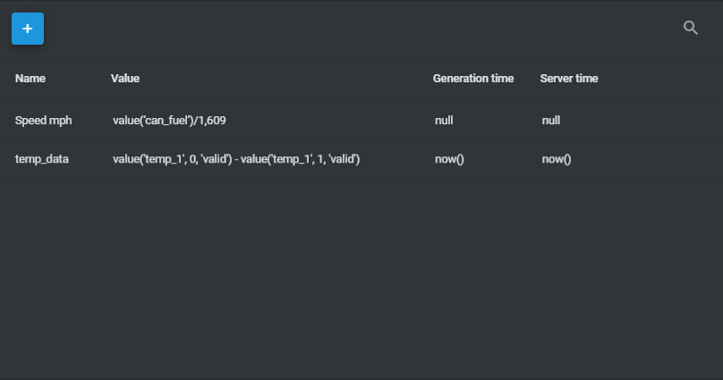

# Navixy IoT Logic Expression Language

## What is Navixy IoT Logic Expression Language

Navixy IoT Logic Expression Language is based on Java Expression Language (JEXL), so it will be familiar to developers. Its syntax uses the "camelCase" method of separating words in function names.\
For example: `thisIsTheFunctionName`

IoT Logic data flows consist of a sequence of nodes that represent the steps of data enrichment. IoT Logic expression language can be used in two nodes:

* Initiate attributes
* Logics

These nodes allow you to manipulate incoming raw data received from devices, third-party services, and other data sources by bringing the data to the necessary format for the recipient: Navixy or another third-party platform.

## IoT Logic functions

Like other expression languages, the IoT Logic Expression Language works via functions that are key points for calculations and other data manipulations. Each function has its own parameters that help you obtain all necessary data from the data stream.

### Explaining main functions

There are three main functions that will be available at the start of the IoT Logic product:

* `value()`: This function is the main method to obtain parameters received from the tracker and attributes calculated inside the IoT Logic product.
* `genTime()`: This function helps to get the date and time when the value was generated on the device side.
* `srvTime()`: This function returns the date and time when the value was received on the IoT Logic server.

Parameters are the same for all functions:

* `device parameter/attribute` : string with device parameter that is supported by the device communication protocol or calculated within the created flow.
* `index` : optional int from 0 to 12. Means how many steps into the past we need to go through to take a value. Where 0 means the newest (or current) value, 12 means 12 values ago from the newest one. If it is not specified, the platform will use a default index = 0.
* `validation flag` : optional string. It can have one of two values: ‘all’ or ‘valid’. When you use ‘all’, it means the historical data including null values. When you use ‘valid’, it means the storage excluding null values. If not specified, the platform will use a default flag = ‘valid’.

Let’s look at how the main functions will return data and examples of how they should be used:

| **Function** | **Return value**                                                                                                           | **Example**                                     |
| ------------ | -------------------------------------------------------------------------------------------------------------------------- | ----------------------------------------------- |
| value()      | Its format depends on the type of data provided by a tracker in the parameter. May be text, boolean, numeric, binary, etc. | value(‘can\_fuel’, 1, ‘valid’)                  |
| srvTime()    | Returns the date and time in Unix-time format of when the value was received on the IoT Logic server.                      | srvTime(‘avl\_255’, 0, ‘all’)                   |
| genTime()    | Returns the date and time in Unix-time format of when the value was generated on the device side.                          | genTime(‘lat’, 5, ‘valid’) or genTime(‘lat’, 5) |

### Work with time formats in Navixy IoT logic

Navixy IoT Logic uses Unix-time in ms, as it is a unified time format in IT systems. Using it, you will be able to send data to other systems where this time will be familiar to most systems and calculated fast. It is defined as the number of milliseconds elapsed since midnight (00:00:00 UTC) on January 1, 1970.

For example, `1490347940000`.

Okay, you say - Unix-time is a great option for manipulations and storing, but what if we want to make it more human-friendly? You can use a special time function to change the format.

`dtFormat('time parameter')` : This function changes the format from Unix-time to ISO 8601. For instance, it will automatically recalculate Unix-time 1720618553 to ISO 8601 2024-07-10T13:35:53.000 UTC+0.

Below is the example of the function:

`dtFormat(genTime('temp_1', 0, 'all'))`

## Using expressions for attributes calculation

### Calculate values for attributes

After IoT Logic receives parameters in the incoming data stream from devices, you now have the ability to calculate new values based on this data. For example, you may want to create a parameter that calculates the difference between the latest temperature value and the previous one. The expression would look like this:

`value('temp_1', 0, 'valid') - value('temp_1', 1, 'valid')`

This expression should be inserted into a special field of the node. Once the expression is set, IoT Logic will calculate this expression in real-time as soon as it receives a data packet from any device in the data stream.

Moreover, this new calculated attribute will be available for the following nodes including next nodes with calculations or logics.

### Calculate date and time for attributes in IoT Logic

For attributes created in the IoT Logic flow processing, the genTime and srvTime parameters are the same and are equivalent to the server date and time in Unix-time in ms when the value was calculated. This value is set by default and corresponds to the now() short function. Additionally, you can rewrite date and time values in two ways:

* You can offset the time by days, hours, minutes, or seconds by adding additional milliseconds via the expression below:`genTime('avl_25', 0, 'valid') + 120000`
* You can calculate the time by subtracting one time value from another:`genTime('avl_25', 0, 'valid') - genTime('avl_25', 1, 'valid')`

After that, the time values will be updated. Also, you can remove any of these time values for the calculated attributes altogether if you want them to be null and/or date/time values are not necessary for the recipient party.
